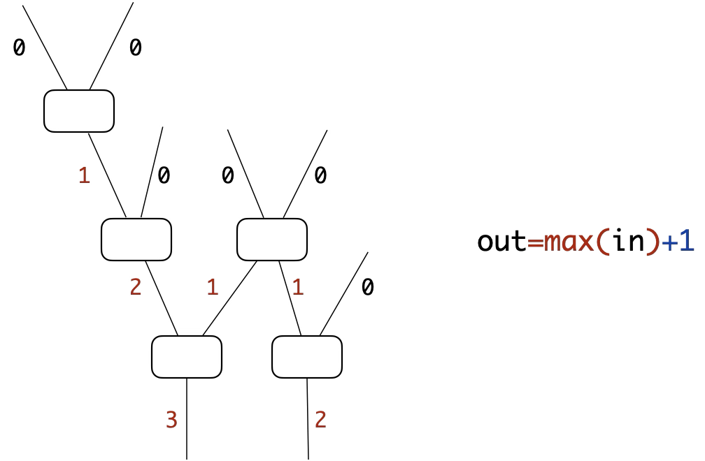
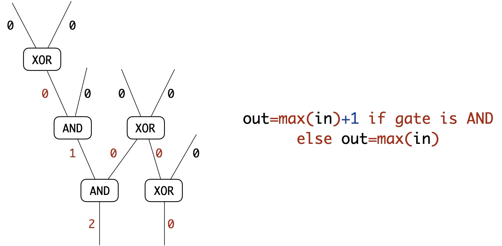

# Intro
This project (**Circuit**) is about Boolean circuit and arithmetic circuit, which are widely used in computer science and cryptography, with applications including Garbled Circuits (GC) and Secret Sharing (SS).

# Run
```shell
python3 bristol_circuit.py
```
## Output
>```
>circuit_file = circuits/aes_128.txt
>#(total gates) = 36663
>#(total wires) = 36919
>#(input variables) = 2, bit length of each vairable [128, 128]
>#(output variables) = 1, bit length of each variable [128]
>circuit depth = 308
>circuit logic AND gate depth = 60
>circuit logic XOR gate depth = 231
>circuit logic INV gate depth = 29
>
>circuit input: 0000000000000000000000000000000000000000000000000000000000000000000000000000000000000000000000000000000000000000000000000000000011111111111111111111111111111111111111111111111111111111111111111111111111111111111111111111111111111111111111111111111111111111
>circuit output: 01110010011001101011000101111100010010111110001011001110010111110101000001011010101000010101011110010011001100011101101011111100
>
>circuit_file = circuits/zero_equal.txt
>#(total gates) = 127
>#(total wires) = 191
>#(input variables) = 1, bit length of each vairable [64]
>#(output variables) = 1, bit length of each variable [1]
>circuit depth = 7
>circuit logic AND gate depth = 6
>circuit logic XOR gate depth = 0
>circuit logic INV gate depth = 1
>
>Is the circuit a directed acyclic graph (DAG) ? True
>```

# Draw
Copy the content from the generated 'graph.txt' file and paste it into the website at https://dreampuf.github.io/GraphvizOnline.

# Circuit Depth
Here is the method for calculating the depth of the logic gates in Bristol Fashion circuits. Notably, the method supports **depth computation for specified logic gates** within the circuit.

For general gates, 
<div align="center">
  
</div>


For AND gates,
<div align="center">
  
</div>

# Boolean Circuit
## 1-fan-in gate
In total, $4$ types of 1-fan-in Boolean gates exist.
|IN| - | NOT | - | - | 
|:--------:| :---------: | :---------:|:--------:|:--------:|
|**0**| 0 | 1 | 0 | 1 |
|**1**| 0 | 0 | 1 | 1 |

## 2-fan-in gate
In total, $16$ types of 2-fan-in Boolean gates exist.
|IN0|IN1| - |NOR| - | - | - | - |XOR|NAND|AND|NXOR| - | - | - | - |OR| -|
|:--------:| :---------: | :---------:|:--------:| :--------: | :--------: | :---------:|:--------:| :--------: | :--------: | :---------:|:--------:| :--------: | :--------: |:---------:|:--------:| :--------: | :--------: |
|**0**|**0**| 0 | 1 | 0 | 1 | 0 | 1 | 0 | 1 | 0 | 1 | 0 | 1 | 0 | 1 | 0 | 1 | 
|**0**|**1**| 0 | 0 | 1 | 1 | 0 | 0 | 1 | 1 | 0 | 0 | 1 | 1 | 0 | 0 | 1 | 1 |
|**1**|**0**| 0 | 0 | 0 | 0 | 1 | 1 | 1 | 1 | 0 | 0 | 0 | 0 | 1 | 1 | 1 | 1 |
|**1**|**1**| 0 | 0 | 0 | 0 | 0 | 0 | 0 | 0 | 1 | 1 | 1 | 1 | 1 | 1 | 1 | 1 |


# Reference

[Bristol Fashion] https://nigelsmart.github.io/MPC-Circuits

[LowMC Circuit] https://github.com/jacob14916/GigaDORAM-USENIX23-Artifact/blob/main/circuits/LowMC_File.txt

[LowMC Paper] https://eprint.iacr.org/2023/1950.pdf
>... The instantiation of LowMC
we use has 46837 total gates, out of which 1134 are ANDs,
stacked into 9-AND-depth circuit. By contrast, AES has a
total of 36663 gates, out of which 6400 are ANDs, stacked
into a 60-AND-depth-circuit ...
